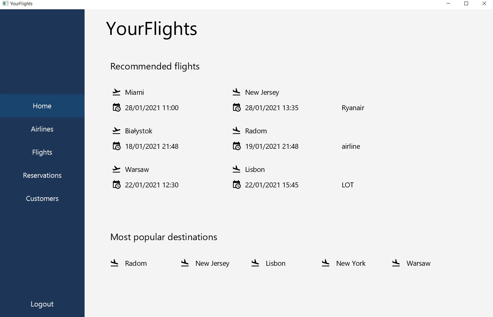
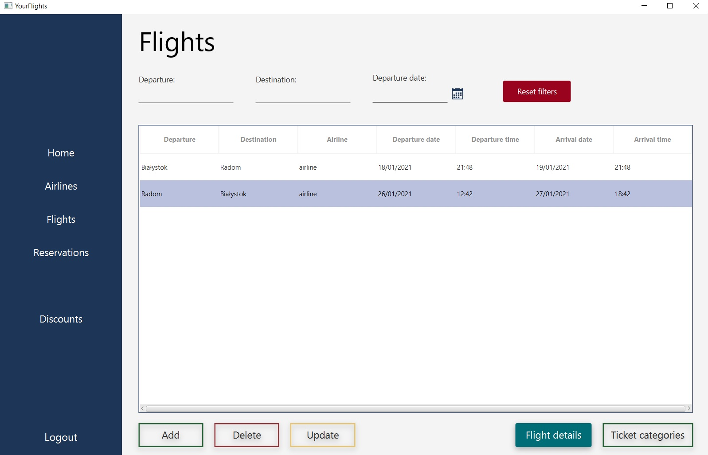
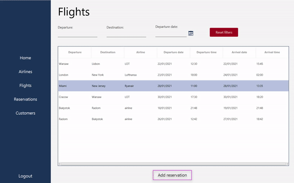

# your-flights
Desktop application for booking airline tickets, built in Java and Spring Boot. 


## Table of Contents

- [About project](#about-project) 
- [Project overview](#project-overview)
- [Technologies](#technologies)  
- [Build](#build)  


## About project

This application is a project for object-oriented technologies classes taking place on the 3rd year of Computer Science at AGH UST.

Project was developed by:

- [Tomasz Kozyra](https://github.com/tkozyra)
- [Kacper Rosiak](https://github.com/rosKacper)
- [Bartosz Kaszuba](https://github.com/kaszubab)
- [Amadeusz Szabała](https://github.com/Amadeusz002)


## Project overview

Your Flights is a Java desktop application for booking tickets for flights. 

The application allows users to register and log in as a Client or as an Airline. Authentication and authorization were built using *Spring Security*.

* User logged in as a **Client** can preview available flights, make reservations for the tickets and manage his bookings. 

* User logged in as an **Airline** can manage existing flights, create new flights, and manage customers' reservations on flights.

* There is an additional **Admin** role, that allows to perform wide range of CRUD operations on customers, airlines, flights, and reservations.

Application is also configured to send emails with booking confirmations to users, as well as upcoming flight reminders.


## Technologies

Technologies used in the project:

- Java 11
- Spring Boot version 2.4.0
- JavaFX version 11.0.1
- JFoenix version 9.0.10


## Build

To run this application:

 - Clone this repository
 - Fill credentials in `application.properties` file

      ```
      spring.application.ui.title=YourFlights
      spring.datasource.url=jdbc:mysql://[host]:[port]/[dbName]?useLegacyDatetimeCode=false&serverTimezone=UTC
      spring.jpa.hibernate.ddl-auto=update
      spring.datasource.username=[username]
      spring.datasource.password=[password]
      ```
 - Build `jar` file using command `gradle bootJar`
 - Run `jar` file using command `java -jar build/libs/yourflights-1.0.0.jar`


## Usage examples


Main view for logged user:





Flight view as a logged in airline:



Making reservation:




